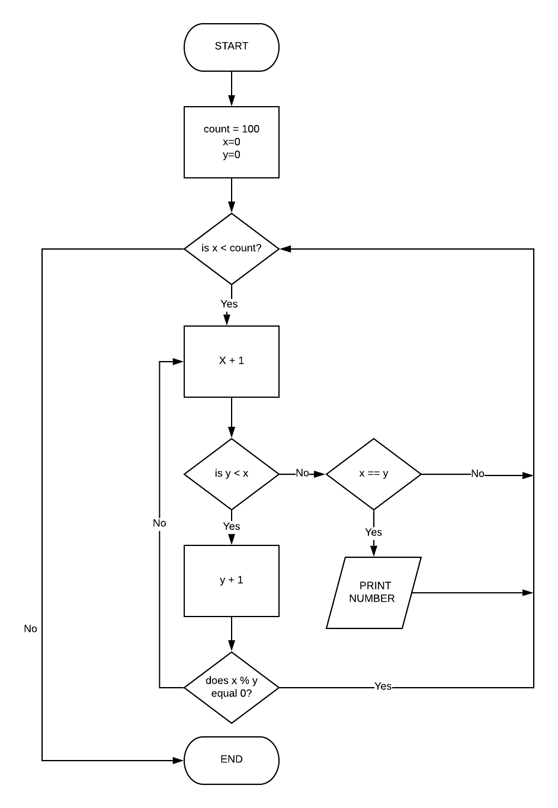

# T1A1 - WORKBOOK
#### By David Johnson

# QUESTION 1
Five key events from 1980 onwards:

#### 1. Creation of the Domain Name System (DNS)

DNS was invented by Paul Mockapetris, with the original specifications published by the Internet Engineering Task Force in November 1983.  

DNS is considered to be the backbone of the internet as we know it - a decentralized and hierarchical naming system that connects URLs with their IP addresses,  making it possible to type words into a browser instead of a string of numbers.  

There were seven “top-level” domain names created - gov, edu, com, net, org, mil and int.


#### 2 The Protocol Wars

Although there was always a common goal of building a global computer network, this could only happen if everyone was using the same Internet Protocol (IP) - which is the method by which data is sent from one computer to another.  

By the early 1980’s there were several competing systems - Europe was using OSI (Open Systems Intercoonect) and the United States were using the Internet/Arpanet protocol (switching from NCP to TCP/IP in January 1983). 

There were also several prominant contenders from the private sector: 
 - IBM's SNA
 - DEC's DECNET
 - Apple's APPLETALK
 - Banyan Vines
 - Novell's IPX

The TCP/IP model eventually won out and is now the dominant protocol suite that is used on today’s Internet.  It is named from the two most important protocols contained within - the Transmission Control Protocol (TCP) and the Internet Protocol (IP),

#### Introduction of the World Wide Web (WWW)

The World Wide Web was invented by British Scientist Tim Berners-Lee in 1989 while he was working at CERN and is an information system that allows documents to connect through hypertext links.

It was originally called “Mesh” and was proposed to persuade CERN that a global hypertext system was not only in CERN’s best interest but was needed to meet the demand for automated information-sharing between scientists in universities and institutes around the world.  

The World Wide Web was launched to the public on August 6 1991.

#### The First Graphical Web Browser 

Until the early 1990’s the internet was used primarily by the government, academics and technology geeks. Although there were already web browsers available, it wasn’t until the introduction of Mosaic in 1993 that the internet became accessible to non-technical people.

Primitive web pages were nothing more than interactive word documents but became instantly popular.  This, combined with the power of emails, allowed people to start understanding the enormous possibilities that came with a large interconnected network.  

#### Commercialization of the Internet

Although there were already commercial enterprises in existence, it wasn’t until 1995 that the internet was first considered to be truly commercialized.  This was due, in part to the development of SSL encryption (Secure Sockets Layer) which allowed for safe financial transactions. It was also the year two major companies were started – the Echo Bay (now EBAY) and Amazon.

The introduction of https (the hypertext transfer protocol encrypted with SSL) as well as user-friendly web browsers and major internet service providers contributed to the dot com boom of the late 1990's.

# QUESTION 2

#### Packets

Packets allow large pieces of information to be transferred accross the TCP/IP network by breaking the data down into smaller pieces or "packets" in order to be compiled again at the other end .  This technology was of critical importance in the development of the internet as it allows for different bandwidths and potential interference while tranferring data from one IP address to another.

#### IP Addresses (IPv4 and IPv6)

IP (internet protocol) addresses are the “digital addresses” used by computers/digital devices - each device has a unique IP address.  This is important because you first need to be able to locate and differentiate between devices before being able to send and receive information.

The common type of IP address is known as IPv4, for "version 4" which uses a 32-bit address space and supports a maximum of 4.3 billion unique IP addresses.

The IPv6 address was later created which consists of eight groups of four hexadecimal digits so theoretically this will never run out of unique addresses.

#### Routers and Routing

A router is a device that relays data packets between computer networks. The process of routing involves assessing a packet received from one host and directing it to the next network.  In order to determine which interface the packet should be forwarded to, routers use routing policies or routing tables (a list of known routes). 

#### Domains and DNS

A domain is a collection of internet addresses that share a common suffix, or under the control of a particular organization or individual. DNS (Domain Name System) is the global database that connects IP addresses with their corresponding domain names. This has greatly helped the internet's usability as it allows users to enter familiar words instead of complex numbers.

# QUESTION 3

#### TCP
TCP (Transmission Control Protocol) is the standard that defines how data is exchanged using the TCP/IP model. 
  
This technology has contributed to the advancement of client and server communication because it is connection oriented, reliable, provides end-to-end communication and ensures the data reaches it’s destination in the same order it was sent. 

#### HTTP and HTTPS

HTTP (HyperText Transfer Protocol) defines how messages are formatted and transmitted and also defines what actions web servers and browsers should take in response.  HTTP is connectionless, media independent and stateless.  

HTTPS is the secure version of HTTP which utilises a SSL/TLS encryption.

This technology contributed to the development of client and server communication by allowing files, images and videos to be carried to devices.  


#### Web Browswers (requests, rendering and developer tools)

A web browser is a program that allows users to view web pages on the internet by translating HTTP into readable content, thus contributing to the development of client and server communication over the internet.  There are a multitude of different browsers available for each operating system, all with their own features.  

The client (browser) submits a HTTP request to the server, which then returns a response to the client. The response contains status information about the request and may also contain the requested content.

The browser then uses a rendering engine to render and display the requested content.  By default the rendering engine can display HTML and XML documents and images.

Modern web browsers also include their own developer tools.  These tools do a range of things, from inspecting currently-loaded HTML, CSS and JavaScript to showing which assets the page has requested and how long they took to load. 

# QUESTION 4

#### Arrays

If you want to save a range of numbers, or pack multiple values into one variable, then you use the data structure called an array. Arrays are commonly used in computer programs to organize data so that a related set of values can be easily sorted or searched.
Data inside an array does not have to be in any order, and arrays can hold any type of data, whether it be a string, an integer, booleans, objects, even additional arrays.

#### Hashes

Hashes are a collection of key-value pairs. They are also known as maps because they map keys (names) to values. Hashing is used to index and retrieve items in a database because it is faster to find the item using the shorter hashed key than to find it using the original value.  Hashing is a more reliable and flexible method of data retrieval than any other data structure

#### Blocks

Blocks are one of the only things in Ruby that is not an object. They are basically a set of instructions associated with a method call. While the method runs, it can invoke the block one or more times. By utilizing blocks you can reduce repetition and even make coding less error-prone.  

# QUESTION 5

A **COMPILER** converts the whole program into intermediate object code in one go.  Once a program is compiled, its source code is not needed for running the code. In general, compiled programs run faster than the interpreted programs however, the memory requirement is greater due to the creation of the object code.  Errors are displayed after compilation, all at the same time which makes error detection difficult. 

An **INTERPRETER** imitates the execution of programs written in a source language and converts the program by taking a single line at a time, this source code is required to run the program every time. In general, interpreted programs run slower than compiled programs. Interpreter’s require less memory as it does not create intermediate object code and as interpreter's display the errors of each line one by one, it makes error detection easier compared to compilers. 

# QUESTION 6

#### RUBY
BENEFITS: Ruby is an eloquent and succinct language.  It has great tooling, high quality code libraries (there’s a gem for just about anything) and a pragmatic approach to software.  The Ruby community is large and full of high calibre engineers who favour responsible development and promote testing and test automation.  Ruby on Rails is extremely popular in Silicon Valley with the likes of Airbnb, Etsy, GitHub & Shopify all using Ruby on Rails

DRAWBACKS: One of the biggest argument against Ruby on Rails is it’s slow runtime speed as well as the boot speed of the Rails framework. Depending on the number of gem dependencies and files, it can take a significant amount of time to start, which can frustrate and hinder developer performance. It can also be hard to find good documentation and resources online for the less popular gems and for libraries which make heavy use of mixins. 

#### PHP

BENEFITS: It’s a flexible mature language with a small learning curve. There are lots of libraries, packages and frameworks available for free and great community support. PHP is extremely popular – much of the web uses PHP as the back end and therefore there are always jobs available for those who can not only create code but also maintenance. PHP has first-class debugging and questions easily answered because chances are someone’s done something similar already.  

DRAWBACKS: Because it’s interpreted and not compiled, performance is not necessarily as good as other languages.  Another issues is because it’s flexible and forgiving it becomes really easy to write bad PHP and also has quite a few inconsistently named functions.  Due to the low learning curve/low barrier of entry, the outside world tends to view PHP as an insecure and entry level language which can affect ability to secure higher paying jobs.  PHP is also rarely used in emerging technologies or process development. Due to threaded execution and the need for global extensions there are also scalability and support issues. 

# QUESTION 7

## Aggressive sales and marketing practices designed to mislead and deceive consumers

Although bullyish sales and marketing tactics are somewhat commonplace these days (for example the people trying to get you to sign up to things outside Woolworths) there are more and more instances popping up on the internet where deceit is used to try and encourage signing up or paying money for ficticious things.  

A popular misleading sales tactic is creating fake posts on social media with enticing captions like “I made $100000 on bitcoin overnight.”  These are purposely designed to encourage unsuspecting people to click and sign up to these offerings with the false hope that there will be a financial benefit

An example of this occurred a couple of years few years ago when my friend Paul’s image was used in a fake post trying to encourage people to invest money in a fake enterprise.  


Any ethical IT proffessional will stay away from working for these companies as it could not only be detrimental to their professional reputation, these practices are also in direct breach of ACCC guidelines.

```
It is illegal for a business to engage in conduct that misleads or deceives or is likely to mislead or deceive consumers or other businesses. This law applies even if you did not intend to mislead or deceive anyone or no one has suffered any loss or damage as a result of your conduct.
```
More information relating to this can be found on the Australian Competition and Consumer Commission website:
```
https://www.accc.gov.au/publications/advertising-selling/advertising-and-selling-guide/avoid-misleading-or-deceptive-claims-or-conduct/misleading-or-deceptive-conduct
```


## Criminal acts

Although there may be some "shades of grey" with regards to ethics in the IT proffession, there are also things that are completely black and white, for example engaging in criminal acts - even if it is done using an online platform.  

**Silk Road** was an online black market and the first modern darknet market, best known as a platform for selling illegal drugs.

As part of the dark web, it used bitcoin as currency and was operated as a Tor hidden service, such that online users were able to browse it anonymously and securely without potential traffic monitoring. 

Ross William Ulbricht (aka. Dread Pirate Roberts) the founder of Silk Road was convicted of Money laundering, Computer hacking, and Conspiracy to traffic narcotics and on May 29 2015 was sentenced to Double life imprisonment + 40 years without possibility of parole. 

IT proffesiionals arouind the world should always try to avoid participating in criminal/illegal activities as it usually ends with damaged reputations and jail time.     

For more information on drug laws in Queensland and Australia:
```
Queensland Government:
https://www.qld.gov.au/law/crime-and-police/types-of-crime/drug-offences

The Australian Federal Proscecution Service:
https://www.cdpp.gov.au/crimes-we-prosecute/serious-drugs/drug-trafficking-selling-and-cultivation
```
# QUESTION 8

Control flow is the order that methods, instructions, and statements are evaluated and executed when a program is running. A good example of this from the Ruby programming language is an if/elsif/else statement: 

``` ruby
puts "enter a number 1-10: "
answer = gets.chomp
answer = answer.to_i;

if answer == 1
  puts "number is 1"
elsif answer == 5
  puts "number is 5"
elsif answer == 10
  puts "number is 10"
else
  puts "number is something other than 1, 5, or 10"
end

  ```
In the code above, the user is asked to provide a number from 1-10.  Once the number is entered and changed into an integer, ruby then executes the if statement from top to bottom.  

If the chosen number is "1", it will print "number is 1" and then stop running. If the number is something else, it will then move onto the first elsif which will checks if the number is "5".  If so it prints and stops, if not it then moves onto the next elsif.  If the number does not match 1, 5, or 10 it then moves to the else statement.  This is an example of control flow.  

# QUESTION 9

Type coercion is the changing of an object's type into another type, together with its value eg. changing a float into an integer, or an integer into a string.

``` ruby
puts "enter a number 1-10:"
answer = gets.chomp
answer = answer.to_i; 
```
In the example from above, when the number is entered by the user it is automatically a string and would need to be changed to an integer to be able to excecute the if/elsif/else statement.  By using the ".to_i" this successfully changes the string into an integer.  

# QUESTION 10

**Boolean:** is a data type that represents only true or false. There is no Boolean class in Ruby.
```ruby
y = false
```
**Symbols:** are like strings but used instead of strings because they can take up much less memory. These belong to class *Symbol*:
```ruby
x = :symbol
```
**Numbers:** Generally a number is defined as a series of digits, using a dot as a decimal mark. 

*Integers* are whole numbers.  These belong to class *Integer*: 
```ruby
puts 15
```
Floating point numbers or *floats* contain decimal points. These belong to class *Float*:
```ruby
puts 15.4596
```
**Strings:** are a group of letters that represent a sentence or a word. These belong to class *String*:

```ruby
puts "this is a string"
```

**Arrays:** store data or list of data. These belong to class *Array*:
```ruby
x = [1,2,3,4,5,6,7,8,9,10]
```

**Hashes:** assign values to keys. These belong to class *Hash*:
```ruby
numbers = {100 => "A", 200 => "B", 300 => "C"}"
```
# QUESTION 11

To solve the problem I would create two classes - each with their own methods:
1. Waitstaff class
2. Kitchenstaff class

Using these two classes I would be able to recreate the entire end-to-end dining experience. This is the easiest way to do it as both classes will contain repeatable methods.   

I would use the following methods for the Waitstaff class:
- greet and seat patron
- input food and drink order
- transfer food and drink from kitchen
- serve bill and facilitate transaction
- clean and reset table

I would use the following methods for the Cook class:
- gather ingredients (as per food and drink order)
- prepare ingredients (as per recipe)
- serve ingredients 

# QUESTION 12

``` ruby
celsius = gets
fahrenheit = (celsius * 9 / 5) + 32
print "The result is: "
print fahrenheit
puts "."
  ```

The issue with the above code is "gets" is currently a string and needs to be an integer for the fahrenheit equation to work.  Changing to "gets.to_i" will correct this issue.     

# QUESTION 13

``` ruby
arr = [5, 22, 29, 39, 19, 51, 78, 96, 84]
i = 0
while (i < arr.size - 1 and arr[i] < arr[i + 1])
  i = i + 1 
end
puts i
temp = arr[i]
arr[i] = arr[i + 1]
arr[i + 1] = temp
 ```

# QUESTION 14



Start with initial values:
count = 100
x = 0
y = 0

- If count is less than 100 continue with the loop
- add 1 to x every iteration through the loop
- when y is smaller than x, add 1 to y. 
- if (x % y) equals 0 return to start of loop, otherwise if (x % y) doesn't equal 0 return to check if y is smaller than x
- when y equals x, the number is prime so prints to screen


# QUESTION 15
```ruby
# If it’s raining and the temperature is less than 15 degrees, print to the screen “It’s wet and cold”,
if is_raining  && temperature < 15
    puts "it's wet and cold"
# if it is less than 15 but not raining print “It’s not raining but cold”.
elsif !is_raining && temperature < 15
    puts "It's not raining but cold"
# If it’s greater than or equal to 15 but not raining print “It’s warm but not raining”,
elsif !is_raining && temperature >= 15
    puts "It's warm but not raining"
# and otherwise tell them “It’s warm and raining”.
else
    puts "It's warm and raining"
    
end
```

# QUESTION 16

```ruby

bit_values = [128,64,32,16,8,4,2,1]

allergens = ["cats","pollen","chocolate","tomato","strawberry","shellfish","peanuts","eggs"] 
puts "what's your score?"

# input score from user
score = gets.chomp.to_i

# work out which bits make up the score

# start loop
patient_allergens = []
bit_values.each do |bit_value|

# find the highest bit value thats lower than the score
    if score >= bit_value
        # save corresponding index of bit value 
        bit_value_index = bit_values.index(bit_value)    
        patient_allergens.push(allergens[bit_value_index])   
      
# remove bit value from input score
       score -= bit_value
    end 

end

# REQUIREMENT A - whether or not allergic to given item
# loop over allergens index and put whether true or false
allergens.each do |allergen|
    # is this allergen present in list of patient allergens
    allergen_index = patient_allergens.index(allergen)
    if allergen_index == nil
        # allergen not found
        puts allergen + " = false" 
    else
        # allergen found
        puts allergen + " = true"
    end
        
end

# REQUIREMENT B - print list of allergens

puts "Full list of allergens: #{patient_allergens}"
```

# END OF ASSSIGNMENT 

